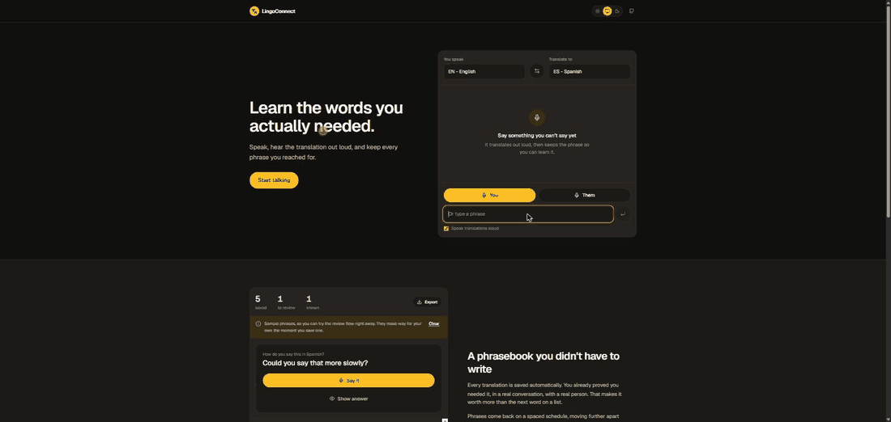

# LingoConnect

Real-time speech translation that keeps what you reached for.



<sub>Recorded with typed input. Speaking is the primary input and runs through
the same path; it just needs a microphone, which a screen recorder does not
have.</sub>

You speak, it translates out loud so the conversation keeps moving, and it
quietly saves the phrase. Later it asks you for that phrase again, and again,
until you own it.

**Live:** https://lingoconnect-pro.vercel.app · **Author:** [Mark Pelico](https://github.com/Markpelico)

---

## The idea

Language apps teach you a curriculum. This one learns yours.

The moment you reach for a translation mid-conversation is the highest-signal
learning event there is: you needed a specific phrase, with a real person, in
a context you cared about, and you did not have it. That moment is already
memorable. The app just makes sure it comes back.

So the translator is not really the product. It is the capture mechanism. The
phrasebook is what you are left with.

Other apps capture vocabulary from things you *read* (a photographed sign, a
subtitle, an article). This one captures from a live spoken conversation,
which is the part nobody else is standing in.

## How it works

```
speak  ->  Web Speech API  ->  /api/translate  ->  speech synthesis
                                     |
                                     v
                             phrasebook (localStorage)
                                     |
                                     v
                         Leitner review: 0, 1, 3, 7, 16 days
```

Everything runs in the browser or in a single serverless route. There is no
database, no account system, and no user data on any server.

## Both sides of the conversation

There are two microphone buttons, one per speaker. Yours listens in the
language you speak and translates outward; theirs listens in the language you
are learning and translates back.

That matters for more than symmetry. Their half is captured as
**comprehension** practice rather than production, because understanding what
was said back to you is the harder skill and the one a phrasebook normally
ignores. A comprehension card asks what a phrase meant instead of how to say
it, and does not offer spoken recall, since saying a meaning back in your own
language proves nothing.

Pointing the recogniser at the right language is not cosmetic: running Spanish
audio through an English model returns confident nonsense rather than an
error.

## Getting your phrases out

Export to Anki, CSV, or JSON. The phrasebook lives in localStorage, so without
an exit route clearing your browser would lose everything, which is a poor fit
for an app arguing against quietly hurting the user. JSON round trips review
progress intact.

## Translation providers

Free and key-less, tried in order. I benchmarked the usual suspects before
picking; most of them are dead:

| Provider | Status | Used |
|---|---|---|
| MyMemory | Working, broad coverage, ~5k chars/day per IP | Primary |
| Apertium | Working, rule-based, narrow pair list | Fallback |
| `translate.googleapis.com/translate_a` | Bot-blocked from cloud IPs | No |
| Lingva (all public mirrors) | HTTP 500; they proxy the endpoint above | No |
| libretranslate.de | Gone (301) | No |
| libretranslate.com | Now requires an API key | No |

Apertium only covers a narrow set of mostly Romance pairs (`eng-spa`,
`eng-cat`, `eng-glg` and the Romance cross-pairs), verified against its own
`/listPairs` endpoint. When it is used, the UI labels the result as a rough
translation rather than presenting it as equivalent.

**When every provider fails, the app says so.** It does not fall back to
invented output. An earlier version of this project shipped a 40-entry
hardcoded phrasebook and, past that, returned the literal string
`[Spanish Translation] <your text>` labelled with 70% confidence. That is a
bad failure mode anywhere, and a genuinely harmful one in an app you are
about to read out loud to another person.

## Running it

```bash
npm install
npm run dev
```

That is the whole setup. **No environment variables and no API keys are
required.**

Optional: MyMemory raises its daily quota from ~5k to ~50k characters if you
send a contact email with each request. The app deliberately does not, so no
personal data leaves the browser. Adding it is a one-line change in
`src/lib/translation/providers.ts` if you want the headroom.

## Browser support

Speech recognition uses the Web Speech API, which exists in Chrome, Edge, and
Safari but **not Firefox**. Everything else works everywhere, and there is a
text input so the full translate-and-capture loop stays usable without a
microphone.

## Stack

Next.js 15 (App Router) · TypeScript · Tailwind v4 · Zustand · Motion ·
Web Speech API

Type checking and linting both run in the production build. They are not
disabled.

## Reviewing out loud

On a review card you can press "Say it" and speak the phrase. The recogniser
listens in the target language and checks whether you produced roughly the
right words.

It is a recall check, not pronunciation scoring, and the distinction is the
whole design. Browser speech recognition is unreliable on non-native speech,
so a system that graded your accent would confidently fail people who said it
correctly. Instead:

- accents and punctuation are normalised away before comparing, because
  recognisers emit them inconsistently
- every alternative the recogniser returns is scored, and the most generous
  one wins
- a clear match advances the card
- anything less hands the decision back to you rather than marking you wrong
- when confidence is low, the verdict is "didn't catch that", never "wrong"
- the transcript is always shown, so any verdict can be checked

Scoring takes the better of Levenshtein similarity and word overlap. Character
distance alone punishes a correct-but-reordered answer; word overlap alone
rewards a wrong answer that shares vocabulary.

## When it isn't sure it heard you

Every recognition result is shown, including the ones the recogniser scored
badly. Uncertain ones are labelled "Not sure I heard that right" and held back
from the phrasebook until you confirm them, but they are never discarded.

This replaced a real bug. The recogniser used to drop any final result below
a confidence threshold without calling the result handler at all, so you could
speak, be heard correctly, and see nothing happen: no transcript, no error, no
indication anything had gone wrong. Recognition confidence is lowest for
accented and non-native speech in noisy rooms, which is the exact audience this
app exists for, so the people it was built for were the ones it ignored.

It survived as long as it did because it lived in the one module excluded from
coverage. The decision logic now sits in a tested module of its own.

## Tests

```bash
npm test              # 173 unit tests
npm run test:coverage # with coverage thresholds enforced
npm run test:e2e      # 24 end-to-end tests
```

Vitest, covering the domain logic and the API route:

| Area | Coverage |
|---|---|
| `lib/phrases.ts` (Leitner scheduling) | 100% |
| `lib/translation/index.ts` (provider chain) | 100% |
| `lib/translation/providers.ts` | 96% |
| `app/api/translate/route.ts` | 92% |

The interesting cases are the ones that bite in practice: a lapse counting
only when a previously known phrase is forgotten, MyMemory reporting an
exhausted quota in-band with HTTP 200, Apertium refusing a pair without
touching the network, and the chain throwing rather than inventing text when
every provider is down.

The Web Speech API wrappers are excluded from coverage deliberately. Covering
them would mean mocking `SpeechRecognition` wholesale, which tests the mock
rather than the code, so they are verified by hand in the browser instead.

Playwright drives the real UI in Chromium for the flows that unit tests
cannot reach: capture, review scheduling, spoken recall, two-way conversation,
uncertain-speech handling, and the export downloads.

Both fakes there exist to remove non-determinism, not to make things pass.
Speech recognition is stubbed because CI has no microphone, and it has to be
installed with `addInitScript` rather than from the page, since the app reads
`window.SpeechRecognition` on first mount and never sees a later stub. The
translation API is mocked so the suite fails when the app breaks rather than
when MyMemory is rate limiting.

CI runs typecheck, lint, unit tests with coverage thresholds, a production
build, and the end-to-end suite on every push and pull request.

## What is not built

Being explicit, since the previous README was not:

- No accounts, no sync. Phrases live in one browser and do not follow you.
- No multi-user or peer-to-peer conversation. An earlier version had a
  Socket.IO scaffold that was never wired up and could not have run on
  serverless; it has been removed rather than left as decoration.
- No pronunciation or accent scoring, on purpose. Spoken review checks which
  words you produced, not how you sounded.
- Translation quality is bounded by what free providers give you. It is good
  for common phrases and travel language, weaker on idiom and long sentences.

## Possible next steps

- Record your attempt on review and play it back against the reference.
- Group phrases by the conversation they came from.
- A mobile app, which is where this concept actually belongs. The whole
  premise is being physically present in a conversation, and that is not a
  desktop situation.

## License

MIT. See [LICENSE](LICENSE).
